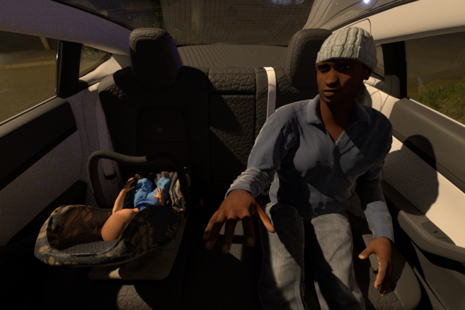
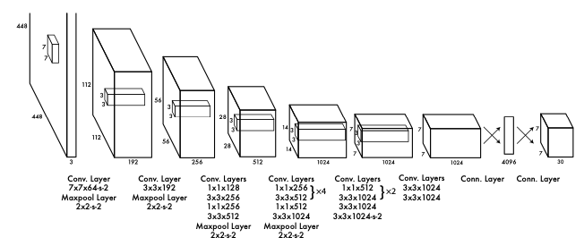
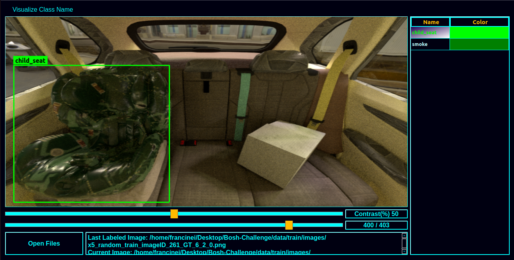
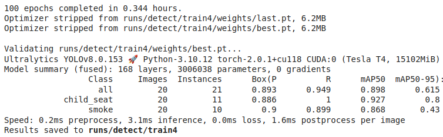
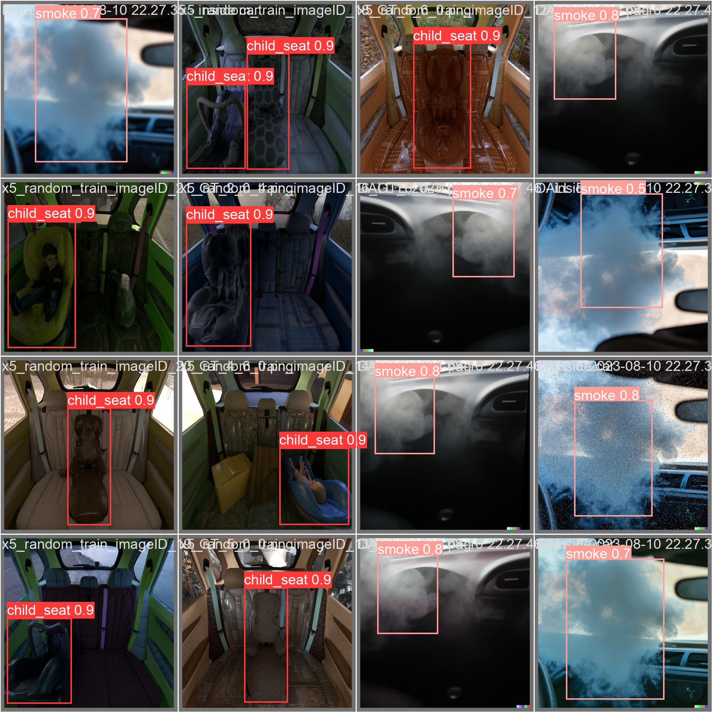

# Project: Child Seat Localization
## Goal
Build AI solution for child seat localization in the passenger vehicle

   

 

## Problem statement
Localization of the child seat in the passenger vehicle enables the business to high-level services
and use cases.

## Suggested dataset
The data set shall be https://sviro.kl.dfki.de/data/ or any appropriate data set.

## Solution scope
The proposed software solution shall / may
* Instrument the data set
* State or use prior work from academic / industry
* Use appropriate state-of-the-art AI algorithm (preferably deep learning based)
* Enhance the data with synthetic
* Reasonable accuracy on the given scope of time to develop
* Rationales for the current Approach to enhance
* Use any appropriate open-source libraries and framework
* Focus more on the algorithm than the overall application
  
## Bonus challenge (optional)
Extend the current dataset with synthetic data by inserting smoke inside the vehicle and
implement an AI smoke detection system.

## Delivery
The solution shall be presented in GitHub / GitLab code with optional supported documents in
email.

# Introduction
The main goal of the project was to develop an AI-based solution for locating a child seat in a passenger vehicle based on an image database. As an extension of the project, smoke detection capability was also included. Systems that perform localization tasks from images are usually called object detectors.

There are several frameworks that provide pre-trained deep learning models that can be customized for the most diverse tasks, including object detection. As an example of frameworks we have: [TensorFlow 2 Object Detection Model Zoo](https://github.com/tensorflow/models/blob/master/research/object_detection/g3doc/tf2_detection_zoo.md) and [Ultralytics YOLOv8](https://docs.ultralytics.com/modes/).

**TensorFlow** is an open-source software library for dataflow and differentiable programming across a range of tasks. It is widely used by data scientists and software engineers for building machine learning models, including object detection models. TensorFlow provides a detection model zoo, which is a collection of pre-trained object detection models that can be used for a variety of applications.

**YoLo: You Only Look Once** is an extremely fast multi-object detection algorithm that uses a convolutional neural network (CNN) to detect and identify objects.
The neural network has this network architecture.

   

* This [guide](https://neptune.ai/blog/how-to-train-your-own-object-detector-using-tensorflow-object-detection-api) provides step-by-step instructions for how to train a custom Object Detector using **TensorFlow Object Detection API**.

* This [guide](https://docs.ultralytics.com/modes/train/) provides step-by-step instructions for how to train a custom Object Detector using **YOLOv8**.

After studying the available documentation on training deep learning models using TensorFlow or YoLo, just for reasons of code simplicity, we decided to use YoLo for the development of our Object Detector.

From the family of models based on YoLo, we chose to use YoLov8 because, at the time of this work, it is considered a state-of-art (SOTA) for training real-time object detectors, offering cutting-edge performance in terms of accuracy and speed. We know that there is a family of models [YOLO-NAS](https://docs.ultralytics.com/models/yolo-nas/#overview) that in some comparative studies presented superior performance to YoLov8, but the YoLo-NAS models have not yet available for customization.

## Step 1. Data preparation

The data quality is one of the main elements that determine the final performance of the solution. It is very important that the data, which in this project corresponds to images, are as diverse as possible. In the case of the child seat in vehicle detection, it is important to have images containing child seats of different sizes, shapes and with images captured in different conditions such as angle, lighting, and contrast.
The same is valid for smoke detection, it is important to have examples containing smoke with different shapes, sizes and captured in images with different lighting conditions.

As suggested in the project scope, most of the images used are synthetically generated. The images containing child seats were obtained at https://sviro.kl.dfki.de/download/. As it is a database containing 25,000 images, we decided to download only the RGB images for the vehicle **BMW-X5-Random**. 

Part of the images containing smoke were generated on the platform [DALL-E 2](https://openai.com/dall-e-2). The DALL-E platform works on a credits model, which allowed us to generate images until the credits available in the free version run out. More images were obtained via search on the Google Image platform.

There are several frameworks that provide pre-trained AI models that can be applied to generate and transform images. The task of generating synthetic images for model training is commonly known as data augmentation. Below I provide some links to works and frameworks for data augmentation:

* https://towardsdatascience.com/a-synthetic-image-dataset-generated-with-stable-diffusion-93e8b557051b
* https://github.com/CompVis/stable-diffusion
* https://huggingface.co/docs/diffusers/index
* https://medium.com/featurepreneur/generate-synthetic-image-data-for-your-next-machine-learning-project-74cf71b65a8f

Due to the project deadline, it was not possible to evaluate/use the frameworks presented in the links above for the generation of synthetic images. We leave this as future work.

Finally, all images were resized to 640x640 and the child seat and smoke objects were manually labeled using the program available [here](https://github.com/developer0hye/Yolo_Label). It is important to note that object detection systems are trained in a supervised way, and therefore need labeled data so that they can calculate their performance metrics. It is also important to point out that the structure of the labels file change depending on the framework we use to train the object detector. Therefore, if we intend to train a model based on YoLo, it is necessary to generate the label files following the pattern expected by YoLo.

   

 
The database for this project is available [here](https://drive.google.com/file/d/1ZuHOVFbKvS60rrRuPWGQ0Qc27awLGhbG/view?usp=drive_link).

## Step 2. Model training
### Using Google Colab (recommended)
The easiest way to train, convert, and export a YoLo model is using Google Colab. Colab provides you with a free GPU-enabled virtual machine on Google's servers that comes pre-installed with the libraries and packages needed for training. 

I wrote a [Google Colab notebook](./yolo_object_detection.ipynb) that can be used to train custom YoLo models. It goes through the process of preparing data, selecting a model for training, training the model, and running it on test images. It makes training a custom YoLo model as easy as uploading an image dataset and clicking Play on a few blocks of code!

Open the Colab notebook in your browser by clicking the icon above. Work through the instructions in the notebook to start training your own model. Once it's trained is possible to [export to other formats](https://docs.ultralytics.com/modes/export/).

## Step 3. Performance evaluation

One popular method for measuring object detection model accuracy is "mean average precision" (mAP). Basically, the higher the mAP score, the better your model is at detecting objects in images. To learn more about mAP, read through this article from [Roboflow](https://blog.roboflow.com/mean-average-precision/).

In the following image, we present the model statistics for the validation set. The model showed satisfactory results for the mAP50 metric. We also noticed a performance reduction for the "smoke" class in mAP50-90, a possible cause was the reduced number of "smoke" base-images available for training since most of the "smoke" images were generated by applying data augmentation over the base-images. Therefore, the result of mAP50-90 indicates the need to obtain a greater number of base-images. The script developed for data augmentation is available [here](./util_scripts/data_augmentation.py).

   

The following figure shows results of objects of type "child-seat" and "smoke" detected by the custom model.

   

## Step 4. Reproducibility
Focusing on the reproducibility of the work, we made available the trained models for this project. They are available in the folder [custom_models](https://github.com/francineimorais/bh_assignment/tree/main/custom_models/runs/detect/train/weights). We also provide the notebook containing the [source code](./yolo_object_detection.ipynb) for training and inference.

## Step 5. Conclusions
In the presented work, we developed an object detection model based on AI and image processing. The model was trained for the detection of child-seat and smoke in vehicle. The model achieved mAP50 > 0.86 for all classes.

The tasks that required the most time to be completed:
* Literature review and evaluation of approaches using TensorFlow and YoLo
* support scripts (ex: data augmentation)
* Documentation (README.md)

We consider that the model performance, as well as the documentation and files generated, are in accordance with the project scope.

## Future works
* Evaluation of frameworks for generating synthetic data, with the objective of generating data containing smoke.
* Use a larger number of child seat images for [training](https://sviro.kl.dfki.de/).
* Train TensorFlow-based models and compare with YoLo-based models. 

## FAQs

Can YoLo only be used for object detection tasks?

 
In addition to object detection, it is also possible to train YoLo-based models to perform tasks such as segmentation, classification, and pose estimation. More information is available at: https://docs.ultralytics.com/tasks/.

What's the difference between training, transfer learning, and fine-tuning?

 
Using correct terminology is important in a complicated field like machine learning. 
Here's my attempt at defining the terms:

* **Training**: The process of taking a full neural network with randomly initialized weights, passing in image data, calculating the resulting loss from its predictions on those images, and using backpropagation to adjust the weights in every node of the network and reduce its loss. In this process, the network learns how to extract features of interest from images and correlate those features to classes. Training a model from scratch typically takes millions of training steps and a large dataset of 100,000+ images (such as ImageNet or COCO). Let's leave actual training to companies like Google and Microsoft!
* **Transfer learning**: Taking a model that has already been trained, unfreezing the last layer of the model (i.e. making it so only the last layer's weights can be modified), and retraining the last layer with a new dataset so it can learn to identify new classes. Transfer learning takes advantage of the feature extraction capabilities that have already been learned in the deep layers of the trained model. It takes the extracted features and recategorizes them to predict new classes. 
* **Fine-tuning**: Fine-tuning is similar to transfer learning, except more layers are unfrozen and retrained. Instead of just unfreezing the last layer, a significant amount of layers (such as the last 20% to 50% of layers) are unfrozen. This allows the model to modify some of its feature extraction layers so it can extract features that are more relevant to the classes trying to identify.

Should I get a Google Colab Pro subscription?

 
If you plan to use Colab frequently for training models, I recommend getting a Colab Pro subscription. It provides several benefits:

* Idle Colab sessions remain connected for longer before timing out and disconnecting
* Allows for running multiple Colab sessions at once
* Priority access to TPU and GPU-enabled virtual machines
* Virtual machines have more RAM

Colab keeps track of how much GPU time you use and cuts you off from using GPU-enabled instances once you reach a certain use time. If you get the message telling you you're cut off from GPU instances, then that's a good indicator that you use Colab enough to justify paying for a Pro subscription.

